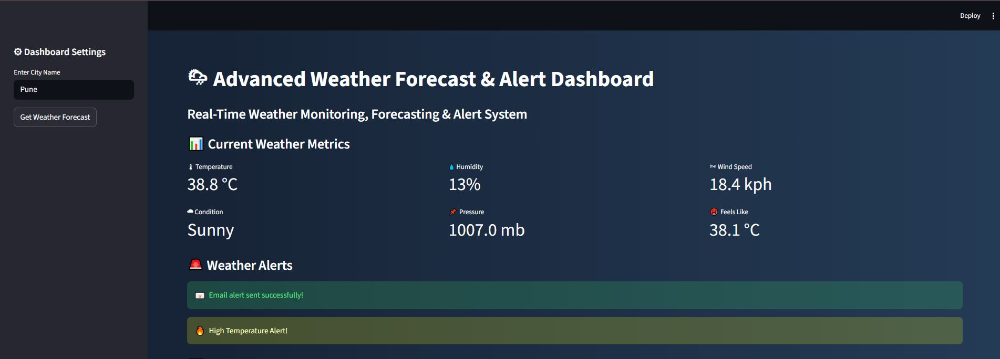
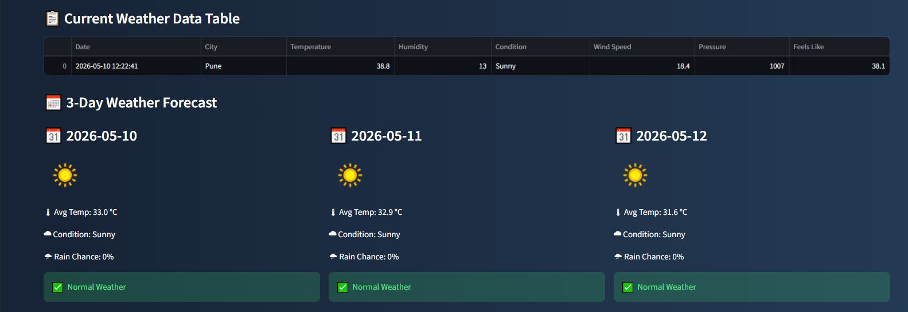
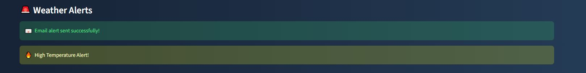
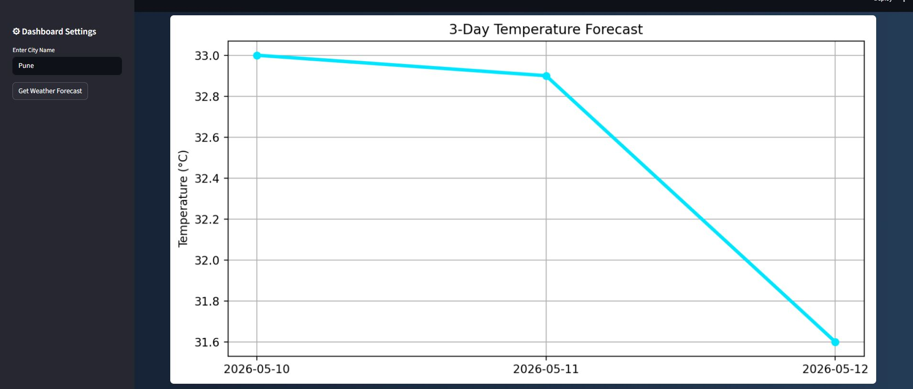

# 🌦 Weather Forecast & Alert Application

An advanced Weather Forecast & Alert Application built using Python, Streamlit, WeatherAPI, Forecast Analytics, Data Visualization, and Automated Email Alerts.

This application provides:

* real-time weather monitoring
* 3-day weather forecasting
* automated weather alerts
* email notification system
* weather analytics dashboard
* colorful visualizations

---

# 🚀 Features

## ✅ Real-Time Weather Monitoring

Fetches live weather data using WeatherAPI.

## ✅ 3-Day Weather Forecast

Displays upcoming weather predictions with:

* temperature
* condition
* rain probability
* weather icons

## ✅ Automated Alert System

Generates alerts for:

* high temperature
* high humidity
* rain
* storms

## ✅ Email Notification System

Automatically sends weather alerts through email using SMTP automation.

## ✅ Interactive Streamlit Dashboard

Modern dashboard with:

* colorful UI
* metric cards
* analytics sections
* sidebar controls

## ✅ Data Visualization

Includes:

* colorful bar charts
* forecast trend graphs
* weather analytics

## ✅ CSV Report Generation

Automatically stores weather reports in CSV format.

---

# 🛠 Technologies Used

* Python
* Streamlit
* WeatherAPI
* Pandas
* Matplotlib
* SMTP Email Automation
* Python Dotenv

---

# 📂 Project Structure

```bash
Weather-Forecast-Alert-Application/
│
├── data/
├── docs/
├── images/
├── outputs/
├── reports/
├── src/
├── .env.example
├── .gitignore
├── app.py
├── main.py
├── requirements.txt
└── README.md
```

---

# ⚙ Installation

## 1️⃣ Clone Repository

```bash
git clone https://github.com/jatingujju/Weather-Forecast-Alert-Application.git
```

---

## 2️⃣ Navigate to Project Folder

```bash
cd Weather-Forecast-Alert-Application
```

---

## 3️⃣ Install Required Libraries

```bash
pip install -r requirements.txt
```

---

# 🔐 Environment Variables

Create `.env` file:

```env
API_KEY=your_weather_api_key

EMAIL_ADDRESS=your_email@gmail.com
EMAIL_PASSWORD=your_gmail_app_password
```

---

# ▶ Run Application

## Streamlit Dashboard

```bash
streamlit run app.py
```

---

# 📊 Dashboard Features

* Real-Time Weather Metrics
* Forecast Analytics
* Weather Alerts
* Email Notifications
* Colorful Visualizations
* Forecast Trend Analysis
* Weather Icons

---

# 📈 Forecast Analytics

The dashboard provides:

* 3-Day Forecast
* Temperature Trend Graph
* Rain Probability Analysis
* Heat Alerts
* Future Weather Monitoring

---

# 📧 Email Automation

Automatically sends email alerts for:

* extreme heat
* storms
* rain warnings
* severe weather conditions

---

# 📷 Screenshots

## Dashboard Preview



---

## Forecast Analytics



---

## Email Alert System



---

## Weather Visualization



---

# 🔥 Future Improvements

* Multi-City Weather Comparison
* Plotly Interactive Charts
* SMS Alerts
* Historical Weather Database
* AI Weather Prediction
* Deployment on Streamlit Cloud
* Dark/Light Theme Toggle

---

# 💼 Project Type

* Advanced Python Project
* API Integration Project
* Automation Project
* Data Analytics Dashboard
* Streamlit Dashboard Application

---

# 👨‍💻 Author

Jatin Gujarathi

---

# ⭐ If you liked this project

Give this repository a star ⭐
